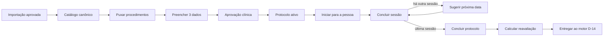

# PRD — Catálogo de Procedimentos e Ciclos de Protocolo

**Versão:** 1.0  
**Data:** 18 de agosto de 2026  
**Produto:** Projeto Consultório.ia / Orquestra IA  
**Módulo:** Procedimentos e Protocolos  
**Status:** rascunho para validação de Produto, Operações e Responsável Clínica  
**Escopo desta entrega:** especificação de produto e processo; nenhuma funcionalidade foi implementada

## 1. Resultado esperado

Criar dentro do sistema um processo simples para a clínica:

1. puxar os procedimentos que oferece;
2. informar quantas sessões são indicadas;
3. informar o intervalo padrão entre as sessões;
4. informar o tempo entre a conclusão do protocolo e a próxima reavaliação;
5. usar essa configuração no atendimento sem redigitar informações;
6. acompanhar as sessões até concluir o protocolo;
7. entregar a data futura ao motor de lembretes D-14.

O caminho comum deverá exigir somente **três informações clínicas por procedimento**:

- quantidade indicada de sessões;
- intervalo padrão entre sessões;
- tempo após a conclusão para reavaliar um possível novo protocolo.

Produto, região, finalidade, ponteira e outras variações só aparecem quando realmente mudarem um desses três valores.

## 2. Decisão central de experiência

O módulo será chamado **Procedimentos e Protocolos**.

Na configuração, a usuária seguirá três passos:

```text
Puxar procedimentos
→ preencher os três dados do protocolo
→ revisar e ativar
```

No atendimento, a equipe seguirá um fluxo ainda menor:

```text
Iniciar protocolo
→ concluir cada sessão
→ concluir protocolo
```

O sistema fará os cálculos e apresentará as próximas datas. A usuária confirma ou ajusta somente quando necessário.

## 3. Princípios de experiência

- **Não redigitar:** nomes já encontrados na base devem aparecer automaticamente.
- **Três campos no caminho comum:** sessões, intervalo e reavaliação.
- **Mostrar apenas o necessário:** intervalo entre sessões desaparece quando o protocolo tem uma sessão.
- **Configuração avançada recolhida:** variantes só abrem quando alteram o ciclo.
- **Salvar automaticamente:** a usuária pode sair e continuar depois.
- **Publicação parcial:** procedimentos incompletos não impedem ativar os que estão prontos.
- **Uma ação principal por etapa:** puxar, revisar ou ativar.
- **Sem decisão clínica pela recepção:** a recepção usa regras publicadas, mas não as altera.
- **Sem decisão clínica pela IA:** a IA pode organizar nomes e sugerir duplicidades, nunca inventar sessões ou intervalos.
- **Sem surpresa:** mudanças de regra não alteram silenciosamente protocolos já iniciados.

Meta de experiência: configurar um procedimento simples em até um minuto e concluir uma sessão em um clique.

## 4. Escopo do MVP

### Incluído

- Buscar procedimentos no catálogo canônico da clínica.
- Mostrar itens novos, já configurados e possivelmente duplicados.
- Confirmar quais procedimentos a clínica oferece.
- Adicionar manualmente um procedimento ausente.
- Configurar quantidade de sessões, intervalo entre sessões e intervalo após conclusão.
- Configurar variações somente quando alterarem o protocolo.
- Salvar rascunhos e publicar cada protocolo separadamente.
- Versionar regras publicadas.
- Iniciar um protocolo para uma pessoa usando o modelo publicado.
- Registrar sessão concluída, cancelada, falta ou reagendada.
- Sugerir a próxima sessão a partir da data real da anterior.
- Confirmar a conclusão do protocolo.
- Calcular a próxima reavaliação.
- Criar uma expectativa interna para o motor de lembretes D-14.
- Permitir ajuste individual com motivo e aprovação.

### Fora do MVP

- Diagnóstico, prescrição ou recomendação automática de tratamento.
- Início automático de um novo protocolo.
- Mensagem externa para a próxima sessão.
- Envio de WhatsApp por este módulo.
- Protocolos com etapas complexas e intervalos diferentes em cada etapa.
- Gestão de estoque, consumo, preço, comissão ou cobrança.
- Agenda completa ou confirmação automática de presença.
- Uso de venda, pagamento ou parcela como prova de sessão realizada.

## 5. Visão do processo completo



Existem três relógios separados:

1. **próxima sessão:** intervalo entre sessões do protocolo;
2. **próxima reavaliação:** intervalo após a conclusão do protocolo;
3. **lembrete D-14:** comunicação tratada pelo PRD de Lembretes.

## 6. Jornada A — Configurar o catálogo

### 6.1 Passo 1 — Puxar procedimentos

Na página **Procedimentos e Protocolos**, a ação principal será:

> **Puxar procedimentos**

O sistema escolhe automaticamente a melhor fonte disponível:

1. catálogo canônico já aprovado, incluindo itens promovidos pelo Onboarding Inteligente;
2. atalho **Importar planilha**, quando ainda não existir catálogo;
3. inclusão manual para exceções.

A usuária não precisa escolher tecnicamente a origem.

O sistema mostra:

- total encontrado;
- quantos já estão configurados;
- quantos precisam de informação;
- quantos parecem duplicados;
- quantos são novos desde a última revisão.

Somente dados promovidos para o catálogo canônico entram automaticamente. Um nome observado em planilha bruta é apenas uma sugestão e não vira procedimento ativo sozinho.

### 6.2 Confirmar a lista encontrada

Para cada item, a usuária escolhe somente:

- **Oferecemos**;
- **Não oferecemos**;
- **É o mesmo que...**, quando existir possível duplicidade.

Correspondências exatas podem ser reaproveitadas. Correspondências ambíguas exigem confirmação humana.

Regras:

- aliases não criam procedimentos duplicados;
- “sem produto informado” permanece pendente;
- “retoque” deve ser relacionado ao procedimento principal quando aplicável;
- nenhum item é excluído do histórico; procedimentos não oferecidos ficam inativos.

### 6.3 Passo 2 — Preencher o protocolo

A configuração aparece em uma única grade ou em cartões simples:

| Procedimento | Sessões indicadas | Intervalo entre sessões | Reavaliar após a conclusão | Estado |
|---|---:|---|---|---|
| Exemplo ilustrativo | 3 | 30 dias | 12 meses | Rascunho |

Perguntas visíveis:

1. **Quantas sessões são indicadas?**
2. **Qual o intervalo entre as sessões?**
3. **Depois da última sessão, quando reavaliar para um possível novo protocolo?**

#### Quantidade de sessões

Opções:

- sessão única;
- quantidade fixa;
- faixa indicada;
- definida na avaliação individual.

Quando houver faixa ou definição individual, a quantidade exata é confirmada ao iniciar o protocolo para a pessoa.

#### Intervalo entre sessões

- Um valor e uma unidade: dias, semanas ou meses.
- O MVP usa um intervalo padrão único entre todas as sessões.
- Se houver apenas uma sessão, o campo fica oculto e não é obrigatório.
- A opção “definido individualmente” continua disponível.

#### Intervalo após a conclusão

- Um valor e uma unidade: dias, semanas ou meses.
- O rótulo exibido será **Reavaliar para possível novo protocolo após**.
- Esse valor não inicia automaticamente um novo tratamento.
- A opção “definido individualmente” não cria expectativa automática até existir uma data aprovada para a pessoa.

### 6.4 Variações somente quando necessárias

Uma seção fechada por padrão pergunta:

> **Este protocolo muda conforme produto, região, finalidade ou ponteira?**

- **Não:** uma configuração atende ao procedimento.
- **Sim:** o sistema abre somente os seletores necessários.

Uma variação deve ser criada apenas quando mudar:

- quantidade de sessões;
- intervalo entre sessões;
- intervalo após a conclusão;
- comportamento de retoque.

Exemplos:

- Toxina pode variar por produto.
- Linear Z pode exigir região, finalidade e ponteira.
- Nomes históricos diferentes com o mesmo ciclo devem ser aliases, não novos protocolos.

### 6.5 Recursos para reduzir trabalho

- salvamento automático;
- filtro **Mostrar apenas incompletos**;
- ação **Aplicar a mesma configuração** para itens selecionados;
- unidades com sugestões comuns;
- valores de manutenção já registrados podem aparecer pré-preenchidos como rascunho;
- validação junto ao campo, sem tela separada de erros;
- nenhum procedimento incompleto bloqueia a publicação dos demais.

### 6.6 Passo 3 — Revisar e ativar

A tela final mostra dois grupos:

- **Prontos para ativar**;
- **Ainda incompletos**.

A responsável clínica revisa o resumo e clica em:

> **Aprovar e ativar protocolos**

Cada ativação registra:

- versão;
- data de vigência;
- responsável pela aprovação;
- data e hora;
- configuração aprovada.

Ativar um protocolo não autoriza mensagens externas aos pacientes.

## 7. Jornada B — Usar o protocolo no atendimento

### 7.1 Iniciar protocolo

Ao selecionar um procedimento publicado para uma pessoa, o sistema:

1. carrega o modelo vigente;
2. mostra a quantidade indicada de sessões;
3. pede confirmação da quantidade exata quando a regra for faixa ou individual;
4. cria o protocolo da pessoa;
5. mostra **Sessão 1 de N**;
6. sugere a primeira ou a próxima data, sem criar presença ou conclusão automática.

A equipe não redigita o nome do procedimento nem os intervalos.

A recepção pode iniciar um protocolo com quantidade fixa já publicada. Quando quantidade ou intervalo forem definidos como faixa ou individuais, uma profissional clínica informa os valores exatos antes do início. Se a reavaliação for individual, a profissional define a data ao concluir o protocolo; até lá, nenhuma expectativa automática é criada.

### 7.2 Concluir sessão

A ação principal será:

> **Concluir sessão de hoje**

Ao confirmar, o sistema registra a data real da sessão.

Se ainda houver sessões:

```text
next_session_on =
  add_interval(previous_completed_session_on, session_interval)
```

O sistema mostra a data sugerida e permite:

- confirmar;
- escolher outra data;
- deixar para agendar depois.

Ajustar a data daquela pessoa não altera o padrão da clínica.

### 7.3 Eventos que não contam como sessão

- agendamento;
- venda;
- nota fiscal;
- pagamento;
- parcela;
- sessão cancelada;
- falta;
- reagendamento sem realização.

Somente um evento confirmado como `COMPLETED` avança o contador.

### 7.4 Concluir protocolo

Depois da última sessão contabilizada, o sistema pergunta:

> **Todas as sessões necessárias foram concluídas?**

Ações:

- **Concluir protocolo**;
- **Adicionar sessão**;
- **Manter em andamento**.

Somente uma profissional clínica pode adicionar uma sessão. Essa ação mantém o protocolo em andamento, atualiza o total **N** e registra responsável, motivo, data e valor anterior. Nenhuma reavaliação é criada enquanto o protocolo permanecer aberto.

Ao concluir:

```text
protocol_completed_on =
  completed_on da última sessão confirmada

next_reassessment_on =
  add_interval(protocol_completed_on, post_protocol_interval)
```

O sistema mostra:

- data de conclusão;
- data sugerida para reavaliação;
- data prevista de ativação D-14, quando aplicável.

### 7.5 Entrega ao motor de lembretes

Um protocolo concluído e baseado em regra publicada cria apenas uma expectativa interna de `maintenance_reassessment`.

O motor de lembretes calcula:

```text
activation_on = next_reassessment_on - 14 calendar_days
```

O PRD de Lembretes continua responsável por:

- D-14;
- identidade e telefone;
- consentimento e opt-out;
- restrição médica;
- canal e template;
- frequência;
- autorização de contato;
- idempotência do envio.

Este novo módulo não envia mensagens.

## 8. Regras de negócio

### 8.1 Fonte do catálogo

- O catálogo canônico é a fonte principal.
- Planilha bruta ou dado em staging não ativa procedimento.
- Procedimento manual gera proposta canônica e verificação de duplicidade.
- Procedimento manual só pode ser ativado depois de reconciliado com o catálogo canônico.
- Receita ou valor financeiro não determina se a clínica ainda oferece o item.
- Desativar um procedimento não apaga histórico.
- Protocolos já iniciados permanecem acessíveis mesmo quando o procedimento é desativado.

### 8.2 Datas e intervalos

- Dias significam dias corridos.
- Semanas equivalem a sete dias corridos.
- Meses são meses civis.
- Se o dia não existir no mês de destino, usar o último dia válido.
- Datas clínicas são armazenadas como data local, sem horário, no fuso publicado da clínica.
- A próxima sessão parte da data real da sessão anterior.
- A próxima reavaliação parte de `protocol_completed_on`.
- Um agendamento existente nunca é movido silenciosamente.

### 8.3 Alterações e versões

- Alterar um protocolo ativo cria nova versão.
- Novos protocolos usam a versão nova.
- Protocolos em andamento mantêm a versão com que começaram.
- Aplicar uma nova versão a protocolos ativos exige confirmação explícita.
- O histórico preserva regra, versão e cálculo usados.

### 8.4 Ajuste individual

Uma profissional autorizada pode ajustar para uma pessoa:

- quantidade de sessões;
- próxima data;
- conclusão antecipada;
- sessão adicional;
- data de reavaliação.

O ajuste exige motivo, responsável, data e valor anterior. Ele não altera o modelo da clínica.

### 8.5 Falha fechada

Vai para revisão quando:

- não existe modelo publicado;
- existem dois modelos aplicáveis;
- falta uma variação obrigatória;
- o evento não comprova realização;
- o registro importado não identifica sessão ou protocolo;
- existem dois protocolos ativos do mesmo procedimento/variante ou com expectativas conflitantes;
- o retoque não possui regra;
- o protocolo foi pausado ou cancelado;
- a data individual exigida não foi definida;
- há divergência entre o protocolo e a regra de lembrete.

Protocolos simultâneos de procedimentos diferentes podem coexistir quando não houver conflito clínico ou de expectativa.

### 8.6 Retoque

A regra publicada de cada procedimento deverá definir se o retoque:

- conta como sessão do protocolo atual;
- é um evento separado que não altera o ciclo;
- reinicia a contagem.

Sem uma dessas definições, o retoque permanece em `REVIEW_REQUIRED`.

## 9. Estados simples

### Procedimento e modelo

Na interface:

```text
A CONFIGURAR → ATIVO → ARQUIVADO
```

Estados internos possíveis: `DRAFT`, `PUBLISHED`, `BLOCKED` e `RETIRED`.

### Protocolo da pessoa

```text
PLANEJADO → EM ANDAMENTO → PRONTO PARA CONCLUIR → CONCLUÍDO
                    ↓
              CANCELADO | REVISÃO
```

### Sessão

```text
PLANEJADA → CONCLUÍDA
      ↓
CANCELADA | FALTA
```

## 10. Papéis e permissões

| Papel | Pode fazer |
|---|---|
| Administrador | Puxar catálogo, confirmar nomes, criar rascunhos e arquivar itens. |
| Responsável clínica | Definir e aprovar sessões, intervalos, variações e ajustes individuais. |
| Recepção | Iniciar protocolo publicado, agendar, registrar status permitido e acompanhar pendências. |
| Profissional clínica | Confirmar sessão realizada, ajustar plano individual e concluir protocolo. |
| Sistema | Organizar sugestões, calcular datas, versionar e criar expectativa interna. |

A organização pode acumular papéis, mas toda ação clínica deve permanecer auditável.

## 11. Telas do MVP

### 11.1 Procedimentos e Protocolos

Uma página com:

- botão **Puxar procedimentos**;
- contadores de ativos e incompletos;
- busca e filtro;
- grade dos três campos;
- seção avançada recolhida;
- salvamento automático;
- botão **Revisar protocolos**.

### 11.2 Revisar e ativar

Esta revisão deve abrir como o passo final da mesma página, sem exigir nova navegação no caminho comum.

- tabela-resumo;
- pendências na própria linha;
- indicação de variações;
- aprovador e vigência;
- botão **Aprovar e ativar protocolos**.

### 11.3 Protocolo da pessoa

- procedimento e versão;
- progresso **Sessão X de N**;
- última sessão concluída;
- próxima sessão sugerida;
- ação **Concluir sessão de hoje**;
- linha do tempo das sessões;
- ação de conclusão do protocolo;
- reavaliação futura após conclusão.

## 12. Modelo de dados mínimo

| Entidade | Finalidade | Campos mínimos |
|---|---|---|
| `CanonicalProcedure` | Catálogo reutilizado do onboarding | organização, nome canônico, categoria, aliases |
| `ClinicProcedureOffering` | O que a clínica oferece | procedimento, nome exibido, ativo, fonte |
| `ProtocolTemplateVersion` | Regra clínica versionada | offering, versão, sessões, intervalo, pós-protocolo, seletores, estado, vigência, aprovação |
| `PatientProtocol` | Aplicação individual | pessoa canônica, template/versão, sessões-alvo, estado, início, conclusão |
| `ProtocolSession` | Sessão do protocolo | protocolo, número, data prevista, data concluída, estado, evento de origem |
| `ProtocolOverride` | Ajuste individual | campo, valor anterior, novo valor, motivo, responsável, data |
| `ReturnExpectation` | Reutilizada do PRD D-14 | protocolo, âncora, regra, reavaliação, ativação, estado |

Campos avançados do template podem incluir produto, região, finalidade, ponteira e comportamento de retoque. Eles não aparecem quando não alteram o ciclo.

Chaves mínimas de proteção contra duplicidade:

```text
protocol = workspace + person + procedure_variant + started_on
session = patient_protocol + sequence + source_event
expectation = patient_protocol + completed_on + template_version
```

## 13. Integrações com os PRDs existentes

### Onboarding Inteligente de Dados

- Reutilizar catálogo canônico e aliases.
- Mostrar automaticamente apenas itens promovidos.
- Manter candidatos ainda não aprovados em revisão.
- Não transformar a planilha da Dra. Marcella em modelo universal.
- Não unir pessoas apenas pelo nome.
- Preservar a procedência de itens importados.

### Lembretes Automáticos de Retorno

- `ProtocolTemplateVersion.post_protocol_interval` passa a ser a fonte clínica do marco.
- Durante a transição, divergência com `ProcedureReturnRule` gera revisão.
- Conclusão cria expectativa interna, nunca envio direto.
- O motor D-14 continua aplicando seus gates.
- O estado de contato externo permanece o definido no PRD de Lembretes.

Contrato mínimo entregue ao motor D-14:

- identificador idempotente da expectativa;
- organização/workspace e pessoa canônica;
- protocolo, procedimento/variante e versão usada;
- `protocol_completed_on` e `next_reassessment_on`;
- estado da expectativa;
- evento posterior de atualização, cancelamento ou substituição.

### Agenda

- A data da próxima sessão é uma sugestão.
- Criar ou mover agendamento exige confirmação.
- Cancelamento ou falta não concluem sessão.
- A integração de agenda pode ser adicionada sem mudar a regra clínica.

## 14. Candidatos iniciais encontrados no caso da Dra. Marcella

Estes itens servem para validar a experiência, não para limitar o produto a esta clínica.

| Candidato | Tratamento inicial |
|---|---|
| Toxina — Dysport e Xeomin | Configurar sessões; prazo pós-protocolo de 4 meses pode vir como rascunho. |
| Bioestímulo — Ellansé, Elleva X e Radiesse | Configurar sessões; 12 meses pode vir como rascunho. |
| Fios Lisos PDO | Configurar sessões; 18 meses pode vir como rascunho. |
| Fios Eyebag | Configurar sessões; 12 meses pode vir como rascunho. |
| Linear Z — regiões registradas | Exigir região, finalidade e ponteira; 6 meses permanece rascunho/bloqueado. |
| Preenchedores registrados | Configurar sessões e retoque; 12 meses pode vir como rascunho. |
| Esvaziador de pernas | Definir sessões e intervalo; manutenção de 12 meses pode vir como rascunho. |
| Retoque de Toxina | Relacionar ao protocolo principal; não criar automaticamente novo procedimento. |
| Consulta | Manter fora deste ciclo enquanto o fluxo de 30 dias estiver indefinido. |

Quantidade de sessões e intervalo entre sessões ainda não foram fornecidos. O sistema deve coletá-los; não pode inferi-los.

## 15. Requisitos funcionais

- `RF-01` Puxar procedimentos canônicos em uma ação.
- `RF-02` Identificar novos itens, aliases e possíveis duplicidades.
- `RF-03` Permitir confirmar o que a clínica oferece sem redigitar nomes.
- `RF-04` Configurar o caminho comum com três informações clínicas.
- `RF-05` Ocultar intervalo quando houver uma sessão.
- `RF-06` Abrir variações somente quando alterarem o ciclo.
- `RF-07` Salvar rascunho automaticamente.
- `RF-08` Publicar procedimentos prontos sem exigir catálogo completo.
- `RF-09` Exigir aprovação clínica para ativar uma regra.
- `RF-10` Versionar mudanças sem alterar protocolos em andamento.
- `RF-11` Iniciar protocolo usando a versão publicada.
- `RF-12` Contabilizar apenas sessão confirmada como concluída.
- `RF-13` Sugerir a próxima sessão a partir da realização anterior.
- `RF-14` Confirmar conclusão antes de criar reavaliação.
- `RF-15` Permitir ajustes individuais auditáveis.
- `RF-16` Criar expectativa interna para o motor D-14.
- `RF-17` Impedir duplicidade em retry, reimportação ou duplo clique.
- `RF-18` Mostrar fila simples de itens que precisam de revisão.

## 16. Requisitos não funcionais

- Interface responsiva e utilizável em celular e computador.
- Salvamento automático com indicação visível de estado.
- Resposta imediata nas ações comuns; processamento longo em segundo plano.
- Isolamento por organização/workspace.
- Permissões por papel e auditoria de ações clínicas.
- Datas calculadas no fuso da clínica.
- Idempotência para protocolo, sessão e expectativa.
- Histórico imutável de versões publicadas.
- Logs sem informação clínica desnecessária.
- Acessibilidade de teclado, foco, rótulos e mensagens de erro.

## 17. Critérios de aceite

1. O administrador visualiza os procedimentos canônicos aprovados em uma página.
2. A clínica confirma o catálogo sem redigitar nomes.
3. Aliases não criam procedimentos duplicados.
4. Um procedimento simples exige somente três informações.
5. Sessão única oculta o intervalo entre sessões.
6. Campos avançados ficam recolhidos no caminho comum.
7. Um procedimento incompleto não bloqueia a ativação dos demais.
8. Regra incompleta ou sem aprovação clínica não pode ficar ativa.
9. A recepção usa regras publicadas, mas não altera configuração clínica.
10. Ao iniciar protocolo, o sistema reutiliza nome, versão e valores publicados.
11. Apenas evento `COMPLETED` conta como sessão.
12. Venda, pagamento, agendamento, cancelamento e falta não contam.
13. A sessão seguinte parte da data real da anterior.
14. Ajustar uma data individual não altera o padrão da clínica.
15. A última sessão exige confirmação para concluir o protocolo.
16. Adicionar sessão ou concluir antes exige ajuste auditável.
17. A próxima reavaliação parte de `protocol_completed_on`.
18. Alterar o modelo cria nova versão.
19. Protocolos em andamento preservam sua versão.
20. Registro sem modelo aplicável vai para revisão.
21. Retry e reimportação não criam duplicidade.
22. Fim de mês e ano bissexto possuem resultado determinístico.
23. Protocolo cancelado ou incompleto não cria manutenção.
24. A conclusão cria somente expectativa interna.
25. Nenhuma mensagem é enviada por este módulo.

## 18. Métricas do piloto

- percentual do catálogo confirmado;
- percentual de procedimentos oferecidos com protocolo ativo;
- tempo médio para configurar um procedimento simples;
- percentual de sessões concluídas com próxima data sugerida;
- percentual de protocolos concluídos com reavaliação calculada;
- quantidade de duplicidades ou conflitos enviados para revisão;
- quantidade de ajustes individuais e seus motivos.

## 19. Ordem de implementação

1. Reutilizar o catálogo canônico e os aliases existentes.
2. Criar a página **Procedimentos e Protocolos**.
3. Implementar os três campos e a aprovação clínica.
4. Versionar modelos publicados.
5. Criar o protocolo da pessoa e o progresso **Sessão X de N**.
6. Registrar conclusão e calcular a próxima sessão.
7. Confirmar conclusão do protocolo.
8. Calcular reavaliação e criar expectativa interna.
9. Integrar a expectativa ao motor D-14.
10. Validar com dados sintéticos antes de qualquer dado real.

## 20. Decisões assumidas para manter o MVP simples

- O intervalo padrão é igual entre todas as sessões.
- Datas individuais podem ser ajustadas sem mudar o modelo.
- “Próximo protocolo” significa reavaliação para possível novo protocolo.
- Um protocolo só termina após confirmação explícita.
- Uma regra publicada é necessária para cálculo automático.
- Procedimentos podem ser ativados individualmente.
- Configuração avançada só aparece quando altera o ciclo.
- Contato externo continua fora deste módulo.

## 21. Definição de pronto

O módulo estará pronto para piloto quando:

- o catálogo aprovado puder ser puxado sem redigitação;
- o caminho comum exigir apenas os três dados definidos;
- a responsável clínica puder revisar e ativar protocolos individualmente;
- a equipe puder iniciar, acompanhar e concluir um protocolo;
- somente sessões realizadas avançarem o contador;
- próxima sessão e reavaliação forem calculadas corretamente;
- versões e ajustes individuais forem auditáveis;
- duplicidades e dados incompletos falharem para revisão;
- a conclusão criar uma expectativa interna compatível com o PRD D-14;
- testes cobrirem sessão única, múltiplas sessões, cancelamento, falta, ajuste, fim de mês, ano bissexto e retry;
- nenhum contato externo ocorrer por este módulo.
